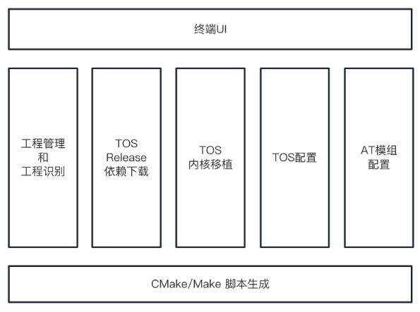

# 关于TOS-Builder的设计

本构建系统的开发的最终结果预期是类似Buildroot构建工具的Make menuconfig，需要支持TOS仓库中board目录下的板级文件，配置并生成不同类别的项目，此外需要配置好编译器和解释器的文件，以便于构建出该工程下的二进制文件，烧录到开发板中，该系统主要功能模块如图所示。
 

目前主流的项目配置和代码生成的环境为STM32CubeMX，该工具可以可视化的修改不同引脚的功能、串口和时钟等配置。

在经过前期的调研过程中，由于STM32CubeMX的板级资源数据库没有公开，不便于直接集成STM32CubeMX的功能。因此，后续的构建系统均以STM32CubeMX配置好芯片的基础工程上进行自动化移植和构建。

此外，本次开发的语言以Rust为主，核心依赖的库包括reqwest, tokio, tui, crossterm, zip和askama，包括网络请求，跨平台终端UI组件，以及模版渲染引擎。

使用Rust开发该系统有一些卓越的优点：内存安全：Rust是一门内存安全的语言，可以避免常见的内存错误，如空指针引用、缓冲区溢出等。这可以减少由于内存错误引起的崩溃和安全漏洞。并发性能：Rust具有出色的并发性能，可以充分利用多核处理器的优势。使用Rust编写构建系统可以利用其并发特性，将多个任务有效地分发到多个线程或进程中，提高整体的构建速度。跨平台支持：Rust具有良好的跨平台支持，可以轻松地编译为各种目标平台的本地代码。使用Rust编写构建系统可以简化跨平台开发和部署过程，提高构建系统的可移植性和兼容性。社区生态系统：Rust拥有活跃的社区生态系统，提供了大量的开源库和工具，可以加快构建系统的开发进度。使用Rust可以利用社区提供的现成解决方案，减少开发工作量，并且可以从社区中获得支持和反馈。

## TOS内核自动化移植

参考Github中针对MDK、IAR、GCC的移植文档，首先用户使用STM32CubeMX完成项目的基础配置，这部分的内容可以参考【TOS移植参考指南】，然后在构建系统中选择或者输入需要移植的项目路径。

### a) 工程管理与识别模块
在CubeMX生成的项目中，已经让用户针对需要导出的项目进行选择，因此，在构建系统中只需要判断导入的项目中的特定文件来识别该项目所属的工程类别。
识别导入的工程后，便可以针对项目跟目录下的配置文件进行预览和配置，例如STM32CubeMX中的.ioc文件或者是MDK下的.uvproj的XML文件配置等。可以使用简单的文件读取和字符串匹配来解析或是XML解析库对应的配置，并且对配置文件进行修改。

### b) TOS Release下载
在TOS的Github仓库中，已经发布多个版本的项目。为了保证代码的稳定性，在移植TOS的内核时，提供给用户选择Release版本的权利（而非main分支），默认选取最新版本的TOS Release下载（目前是v2.5.0）。
在Release版本检测逻辑中，通过请求TOS仓库的Tags页面，获取可用的版本号，并提供给用户进行选择。
利用Rust的异步HTTP请求客户端，完成Release的代码下载和文件解压，并暂存于本地等待后续的移植操作。

### c) TOS 内核移植
该部分的工作主要是利用程序化的流程，完成Github文档中MDK工程、IAR工程和GCC工程的移植和配置修改的操作。主要操作步骤为：

1. 拷贝目录：在TOS的Release代码中提取arch、kernel、osal，并在board下拷贝CubeMX的工程。
2. 移植ARCH平台：（目前以ARM Cortex M核为主）通过配置文件/内置映射表/用户自主选择的方式，选择port文件。
3. 移植内核源码：拷贝kernel下的core和pm目录，并且提供给用户选择是否移植低功耗（pm）模块。
4. 移植CMSIS源码：拷贝CMSIS代码。
5. 添加头文件：提供给用户选择优先级、各类宏的配置，并且将结果填充到模版文件中，并拷贝配置头文件中。
6. 添加示例工程：在前面工作完成后，提供给用户可选的demo移植工程，即修改CubeMX生成的终端函数和调度函数，并且拷贝串口打印的测试代码到对应项目下。

### d) AT框架和驱动配置
在移植内核成功后，在该基础上可选移植AT框架和SAL框架。
参考步骤c中的操作，首先在终端中配置tos_at.h的宏，并且将Release包中的net/at目录和platform/hal/st下对应芯片src目录下的tos_hal_uart.c文件，并且拷贝对应的头文件到依赖中。此外，参考Github文档修改CubeMX生成代码中的驱动文件，添加头文件依赖、添加中断函数、添加全局变量和使能中断，完成AT框架兼容。
移植SAL框架，即拷贝net/sal_module_wrapper文件到工程中。
移植通信模组驱动，在Github仓库中已有比较多的验证后的驱动，例如esp8266，可以在终端界面中遍历devices下支持的驱动，并且将选中的驱动头文件和源文件拷贝到项目中。
在修改完成后，还需要在工程文件中（例如.uvproj）中修改项目中依赖的配置（头文件）。

## Make/CMake构建系统移植
在代码移植完成后，为完成构建系统的工作，还需要引入外部构建系统来完成系统构建工作。目前在C/C++领域主流的是CMake/Make构建系统。由于GCC构建工程已经建立在Make构建系统上，因此下面的设计主要是支持MDK和IAR工程使用CMake/Make构建系统。
在uVision和IAR的官方文档中，都提供了使用命令行编译MDK/IAR工程的介绍。
在Keil MDK工程中，可以使用UV4命令行构建工程。此外，为了适用Make构建系统，在Keil工具中还提供了ARMCC等构建和连接的命令行工具。
在IAR工程中，同样提供了IarBuild命令行用于构建工程，此外，官方还提供了CMake的示例工程。
因此，在实现中，通过终端界面让用户选择对应项目的解释器和连接器的位置，然后填充到对应的Makefile/CMakeLists.txt配置文件中，完成CMake/Make的项目支持，在终端中只需要使用make构建工具对系统进行构建即可，并且使用这种构建方式可以支持在VS Code，CLion等编辑器中开发，获得更智能的代码提示功能（参考ESP32）。

## 验证和文档撰写

由于本次项目的最终目的是能够自动化配置和构建MDK/IAR/GCC的工程，因此需要对构建的结果进行测试。这里选取的测试的环境是QEMU（开源的虚拟机仿真环境）测试STM32的移植结果，或者是使用Keil等编辑器自带的仿真环境测试移植的结果是否正确。如果使用GCC的方式构建，还可以利用QEMU虚拟机的GDB调试端口调试系统内核。
此外，作为一个开源的TOS构建系统，预期利用Github的CI流水线构建该构建系统工具，方便用户获取在Win/Mac/Linux下的可执行文件，另外还需要提供详细的文档以供用户上手和查询；为了方便对齐项目的开发进度，还需要针对开发的问题和开发的成果进行汇总和记录。
