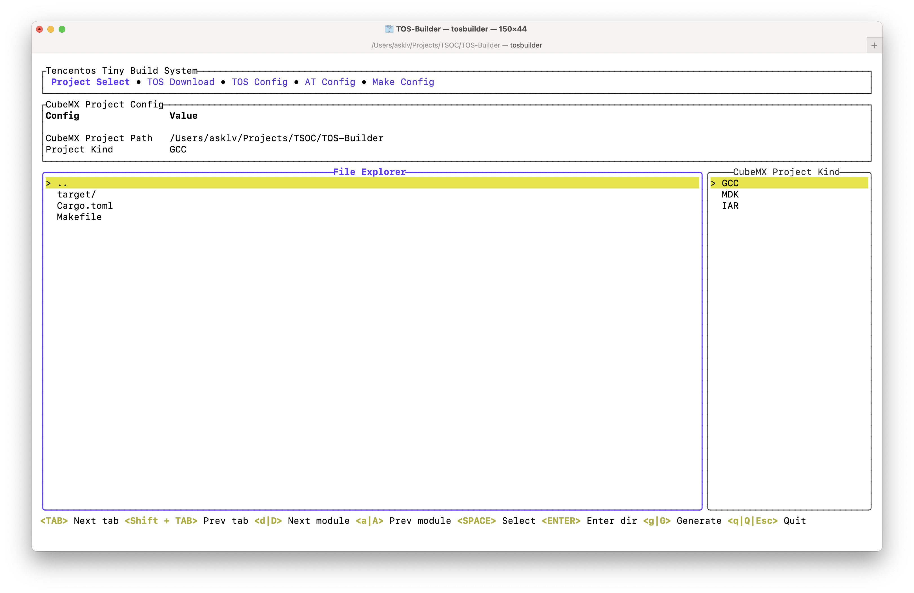

# TOS-Builder 

<!--  -->

<p align="center">
    <a href="./README.md"><b>English</b></a> •
    <a href="./README_zh-CN.md"><b>中文</b></a>
</p>

A simple terminal build tool for [TencentOS-tiny](https://github.com/OpenAtomFoundation/TencentOS-tiny), which can be used to quickly build TencentOS-tiny and its application examples.

## 🧩 Awesome features

1. [TOS-Builder](https://github.com/IRONICBo/TOS-Builder) is an build system tool based on `Rust`.
2. Like `menuconfig` but it has modern user interfaces with [ratatui](https://github.com/ratatui-org/ratatui).
3. Easy to `config` and use `make` to build bin files.

## 📺 System Preview

<details open> 
    <summary>Project Select</summary>
    
</details>
<details> 
    <summary>TOS Download</summary>
    
</details>
<details> 
    <summary>TOS Config</summary>
    
</details>
<details> 
    <summary>AT Config</summary>
    
</details>
<details> 
    <summary>Make Config</summary>
    
</details>

## Get started 🚀

TODO...

## 📦 Build

#####  Pre-requisites

- [Rust](https://www.rust-lang.org/tools/install)
- [Git](https://git-scm.com/downloads)

##### Clone this repository

```bash
git clone https://github.com/IRONICBo/TOS-Builder
```

##### Build for release

```bash
cd TOS-Builder
cargo build --release
```

##### Run

```bash
cd target/release
./tosbuilder
```