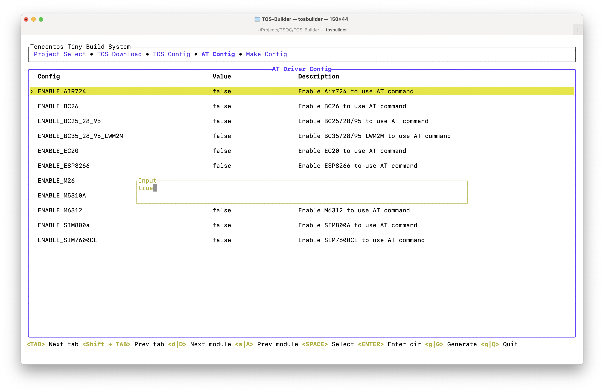

# TOS-Builder 

<!--  -->

<p align="center">
    <a href="./README.md"><b>English</b></a> •
    <a href="./README_zh-CN.md"><b>中文</b></a> •
    <a href="./PROPOSAL.md"><b>Proposal</b></a> •
    <a href="./Log.md"><b>Develop</b></a> 
</p>

A simple terminal build tool for [TencentOS-tiny](https://github.com/OpenAtomFoundation/TencentOS-tiny), which can be used to quickly build TencentOS-tiny and its application examples.

<p align="center">
    
</p>

## 🧩 Awesome features

1. [TOS-Builder](https://github.com/IRONICBo/TOS-Builder) is an build system tool based on `Rust`.
2. Like `menuconfig` but it has modern user interfaces with [ratatui](https://github.com/ratatui-org/ratatui).
3. Easy to `config` and use `make` to build bin files, with MDK, IAR, GCC.


## 📺 System Preview

<details open> 
    <summary>Project Select</summary>
    
</details>
<details open> 
    <summary>TOS Download</summary>
    
</details>
<details open> 
    <summary>TOS Config</summary>
    
</details>
<details open> 
    <summary>AT Config</summary>
    
</details>
<details open> 
    <summary>Generate Config</summary>
    
</details>

## Get started 🚀

### 1. Preparation before porting

Refer to the official TOS porting tutorial to prepare the STM32CubeMX base project.

- [Prepare MDK base environment](https://github.com/OpenAtomFoundation/TencentOS-tiny/blob/master/doc/10.Porting_Manual_for_KEIL.md)
- [Prepare IAR base environment](https://github.com/OpenAtomFoundation/TencentOS-tiny/blob/master/doc/11.Porting_Manual_for_IAR.md)
- [Prepare GCC base environment](https://github.com/OpenAtomFoundation/TencentOS-tiny/blob/master/doc/12.Porting_Manual_for_GCC.md)

### 2. Building TOS-Builder

> TOS-Builder binaries are available in Release :)

##### 1. Preparing the rust environment

The main way to install Rust is through the tool Rustup, which is both a Rust installer and a versioning tool.

You appear to be running macOS, Linux, or some other Unix-like system. To download Rustup and install Rust, run the following command in a terminal and follow the on-screen instructions.

```bash
curl --proto '=https' --tlsv1.2 -sSf https://sh.rustup.rs | sh
```

If you are on Windows, download and run [rustup-init.exe](https://static.rust-lang.org/rustup/dist/i686-pc-windows-gnu/rustup-init.exe).

##### 2. Clone the repository

```bash
git clone https://github.com/IRONICBo/TOS-Builder
```

##### 3. Build

```bash
cd TOS-Builder
cargo build --release
```

##### 4. Run

```bash
cd target/release
. /tosbuilder
```

### 3. Basic usage steps

##### 1. Selecting a Project

Before you start building TOS, you need to select a project, either a new project or an existing project.The TOS build system provides the option to create a new project, and you can specify the name and path of the project. For an existing project, you can select a project directory that already exists.

After selecting a project, the TOS build system will provide a file selection system for selecting files and directories to be included in the build. You can add files or directories to the build system by simply checking them off. This allows you to select specific files needed for your project and exclude unneeded files to reduce the size of the build.

The TOS build system provides several project category options to meet the needs of different types of applications. You can select the project category that is right for you, such as General Purpose Applications, IoT Devices, Embedded Sensors, and more. Each project category has predefined configurations and default options that enable you to quickly start building a specific type of application.

TOS supports a wide range of development boards and chip platforms. The build system provides a development board chip selection interface from which you can choose the chip model for your development board. This will ensure that the build system is properly configured and adapted to the TOS operating system for your target hardware platform.

##### 2. TOS System Preparation

TOS provides a packaged build system, which includes a pre-configured project, a file selection system, a project category and a development board chip selection. You can directly select this build system and build with simple operations. This option is good for getting started quickly and making simple project customizations.

TOS provides a zip file download option on the side corresponding to the release version. You can select and download the release applicable to your development board and project according to your needs. The downloaded zip file usually contains pre-compiled library files, sample code and documentation. Once downloaded, you can extract the zip file to the appropriate directory and then proceed with further configuration and development based on the documentation and examples provided.

##### 3. Configuration Options

In the TencentOS tiny (TOS) and AT (Application Development Toolkit) sections, the system encapsulates some commonly used components, such as pop-ups, inputs and outputs, to allow for customized selection of configurations at startup. Such encapsulation allows users to customize the behavior and functionality of the system according to their needs through simple selection and configuration.

With the system's encapsulated pop-up window component, an interactive window is displayed at startup that allows the user to select various configuration options. These options can include the system's mode of operation, function switches, communication interface settings, and so on. The user can select the appropriate options through the pop-up window, and then the system will be configured accordingly.

Similarly, the encapsulation of input and output components allows the user to configure them at startup. For example, the system can provide an input interface for the user to enter some parameters or configuration information. The user can provide the desired information via a keyboard, serial port, or other input device. The system can then use this input information for subsequent processing and configuration.

This encapsulation of customized choice configuration makes the system configuration process more flexible and user-friendly. Users can customize the behavior and functionality of the system to suit their needs without having to manually modify the source code or perform complex configurations. This greatly simplifies the system configuration process and improves the development efficiency and convenience for users.

##### 4. Project Generation

If you use the command "g" or "G" to generate a project, then the ported project will be automatically generated in the "generated" directory under the selected file directory and updated. This feature helps you to automatically generate and update the directory structure and files of the project.

Such an automatic generation and update mechanism reduces the effort of creating and managing projects manually and ensures the consistency of the project structure. Whenever you run the "g" or "G" command, the tool checks the generated project structure and updates it as needed. This means that you can easily use this command to create the initial structure of your project and use it to add new files or update existing files during subsequent development.

##### 5. Project Build

After the corresponding project is generated, you can open the project directly in IAR, MDK, GCC and modify PendSV_Handler to `__weak` and finally compile it directly.

##### 6. Logging

"tos_builder.log" is a text file that records build system operations and information. It will record important events, error messages, warnings, and other information related to the build of your project. By looking at this log file, you can see what is happening during the build of your project and find out what might be causing the problem.

To locate a problem, you can use a text editor or terminal tool to open the "tos_builder.log" file and look for keywords, error messages, or specific actions you encountered. The log may contain useful debugging information, such as compilation errors, dependency problems, configuration conflicts, and so on. By analyzing the contents of the log, you can better understand what is happening during the build process and take appropriate action to resolve the problem.

##### 7. Configuration File Storage

The TOS build system uses configuration files to store configuration information about a project. These configuration files are usually stored in the root directory of the project under `config.json` for use during the build process. You can use a text editor or terminal tool to open these configuration files and view their contents.

## 📚 Docs

- Find **develop logs** here: [Develop Log](./Log.md)

## 📦 Build

#####  Pre-requisites

- [Rust](https://www.rust-lang.org/tools/install)
- [Git](https://git-scm.com/downloads)

##### Clone this repository

```bash
git clone https://github.com/IRONICBo/TOS-Builder
```

##### Build for release

```bash
cd TOS-Builder
cargo build --release
```

##### Run

```bash
cd target/release
./tosbuilder
```