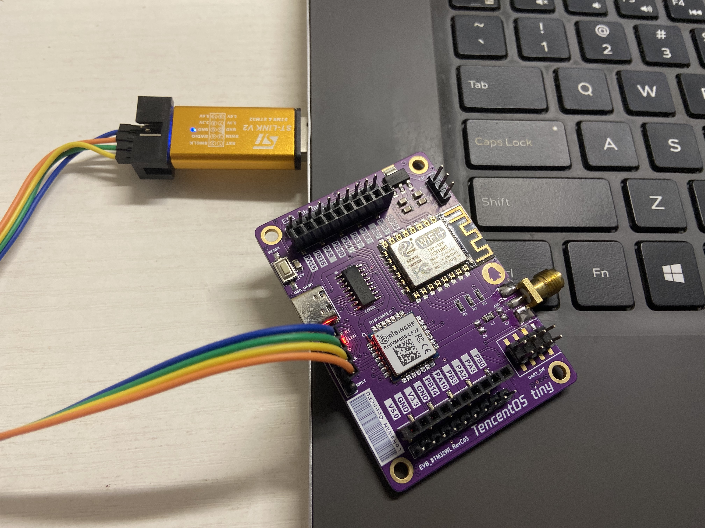
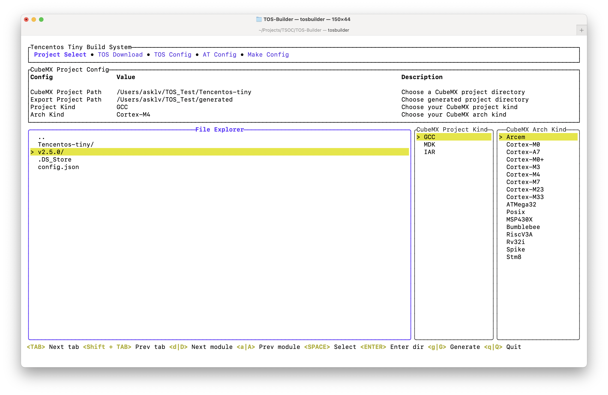
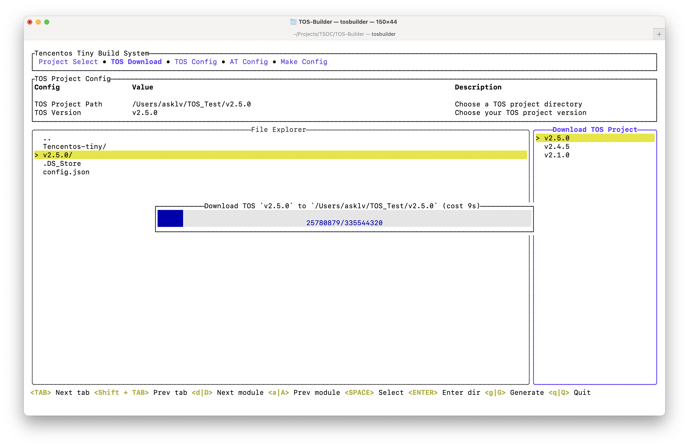
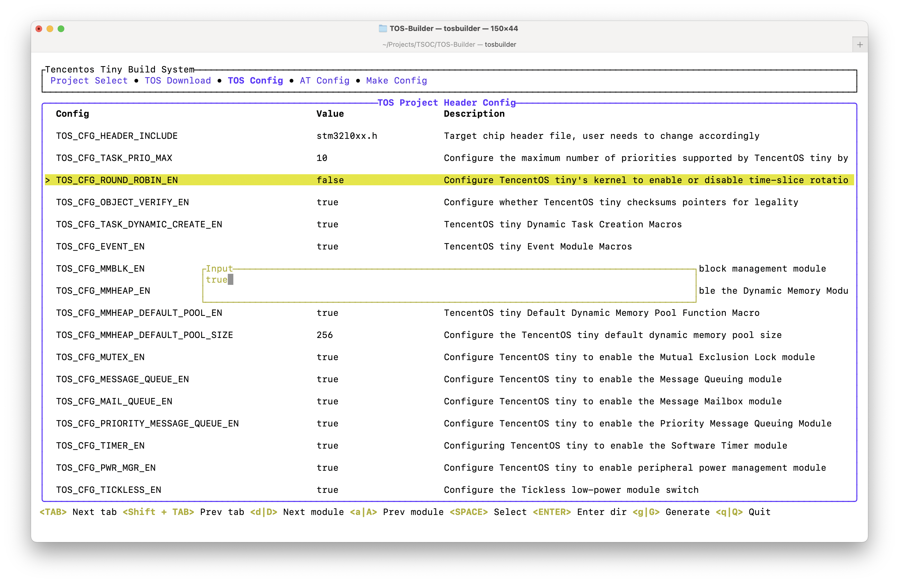

# TOS-Builder 

<!--  -->

<p align="center">
    <a href="./README.md"><b>English</b></a> •
    <a href="./README_zh-CN.md"><b>中文</b></a> •
    <a href="./PROPOSAL.md"><b>提案</b></a> •
    <a href="./Log.md"><b>开发日志</b></a> 
</p>

一个简单的终端构建工具，用于快速构建[TencentOS-tiny](https://github.com/OpenAtomFoundation/TencentOS-tiny)及其应用示例。

<p align="center">
    
</p>

## 🧩 优秀特性

1. [TOS-Builder](https://github.com/IRONICBo/TOS-Builder) 是一个纯Rust编写的，为TencentOS-Tiny准备的的构建系统工具。
2. 与 `menuconfig` 类似，但它拥有 [ratatui](https://github.com/ratatui-org/ratatui) 的现代用户界面。
3. 极易配置，以及快速集成MDK，IAR，GCC。



## 📺 系统预览

<details open> 
    <summary>工程选择</summary>
    
</details>
<details open> 
    <summary>TOS下载</summary>
    
</details>
<details open> 
    <summary>TOS配置</summary>
    
</details>
<details open> 
    <summary>AT配置</summary>
    
</details>
<details open> 
    <summary>项目生成</summary>
    
</details>

## 快速上手 🚀

### 1. 移植之前的准备

参考TOS官方的移植教程，准备好STM32CubeMX的基础工程。

- [准备MDK基础环境](https://github.com/OpenAtomFoundation/TencentOS-tiny/blob/master/doc/10.Porting_Manual_for_KEIL.md)
- [准备IAR基础环境](https://github.com/OpenAtomFoundation/TencentOS-tiny/blob/master/doc/11.Porting_Manual_for_IAR.md)
- [准备GCC基础环境](https://github.com/OpenAtomFoundation/TencentOS-tiny/blob/master/doc/12.Porting_Manual_for_GCC.md)

### 2. 构建TOS-Builder

> TOS-Builder的二进制文件可以在Release中获取 :)

##### 1. 准备rust环境

安装 Rust 的主要方式是通过 Rustup 这一工具，它既是一个 Rust 安装器又是一个版本管理工具。

您似乎正在运行 macOS、Linux 或其它类 Unix 系统。要下载 Rustup 并安装 Rust，请在终端中运行以下命令，然后遵循屏幕上的指示。

```bash
curl --proto '=https' --tlsv1.2 -sSf https://sh.rustup.rs | sh
```

如果您在 Windows 上，下载并运行[rustup-init.exe](https://static.rust-lang.org/rustup/dist/i686-pc-windows-gnu/rustup-init.exe).

##### 2. 克隆仓库

```bash
git clone https://github.com/IRONICBo/TOS-Builder
```

##### 3. 构建

```bash
cd TOS-Builder
cargo build --release
```

##### 4. 运行

```bash
cd target/release
./tosbuilder
```

### 3. 基本使用步骤

##### 1. 选择工程

在开始构建TOS之前，您需要选择一个工程，可以是新建工程或现有工程。TOS构建系统提供了创建新工程的选项，您可以指定工程的名称和路径。对于现有工程，您可以选择已经存在的工程目录。

在选择工程后，TOS构建系统将提供文件选择系统，用于选择要包含在构建中的文件和目录。您可以通过简单地勾选文件或目录来添加它们到构建系统中。这使您能够选择项目所需的特定文件，并排除不需要的文件，以减小构建的大小。

TOS构建系统提供了多个项目类别选项，以满足不同类型的应用需求。您可以选择适合您的项目类别，例如通用应用、物联网设备、嵌入式传感器等。每个项目类别都有预定义的配置和默认选项，使您能够快速开始构建特定类型的应用。

TOS支持多种开发板和芯片平台。构建系统提供了一个开发板芯片选择界面，您可以从中选择适用于您的开发板的芯片型号。这将确保构建系统正确配置和适配TOS操作系统以适应您的目标硬件平台。

##### 2. TOS系统准备

TOS提供了封装好的构建系统，其中包括了预配置的工程、文件选择系统、项目类别和开发板芯片选择。您可以直接选择这个构建系统，通过简单的操作即可进行构建。这种选项适合于快速开始并进行简单的项目定制。

TOS在侧边提供了对应发布版本的压缩文件下载选项。您可以根据您的需求选择并下载适用于您的开发板和项目的发布版本。下载的压缩文件通常包含预编译的库文件、示例代码和文档。下载后，您可以将压缩文件解压到适当的目录，然后根据提供的文档和示例进行进一步的配置和开发。

##### 3. 配置选择

在TencentOS tiny（TOS）和AT（应用开发工具包）部分中，系统封装了一些常用的组件，例如弹窗、输入输出等，以便在启动时进行定制化选择配置。这样的封装使得用户可以根据自己的需求，通过简单的选择和配置来定制系统的行为和功能。

通过系统封装的弹窗组件，在启动时显示一个交互式的窗口，让用户选择各种配置选项。这些选项可以包括系统的运行模式、功能开关、通信接口设置等。用户可以通过弹窗选择相应的选项，然后系统将根据这些选项进行相应的配置。

类似地，输入输出组件的封装允许用户在启动时进行配置。例如，系统可以提供一个输入接口，让用户输入一些参数或配置信息。用户可以通过键盘、串口或其他输入设备提供所需的信息。然后，系统可以使用这些输入信息进行后续的处理和配置。

这种定制化选择配置的封装使得系统的配置流程更加灵活和友好。用户可以根据自己的需求定制系统的行为和功能，而无需手动修改源代码或进行复杂的配置。这大大简化了系统配置的过程，提高了用户的开发效率和便利性。

##### 4. 项目生成

如果您使用命令 "g" 或 "G" 来生成项目，然后会自动在所选的文件目录下的 "generated" 目录中生成移植好的项目，并进行生成更新。这个功能可以帮助您自动生成和更新项目的目录结构和文件。

这样的自动生成和更新的机制可以减少手动创建和管理项目的工作量，并确保项目结构的一致性。每当您运行 "g" 或 "G" 命令时，工具会检查已生成的项目结构，并根据需要进行更新。这意味着您可以方便地使用这个命令来创建项目的初始结构，并在后续开发过程中使用它来添加新的文件或更新现有文件。

##### 5. 项目构建

对应项目生成完成后，可以在IAR，MDK，GCC中直接打开项目，并且修改PendSV_Handler为`__weak`，最后直接进行编译。

##### 6. 日志记录

"tos_builder.log" 是一个记录了构建系统操作和信息的文本文件。它会记录一些重要的事件、错误消息、警告以及其他与项目构建相关的信息。通过查看这个日志文件，您可以了解项目构建过程中发生的情况，并找到可能导致问题的原因。

定位问题时，您可以使用文本编辑器或终端工具打开 "tos_builder.log" 文件，并查找关键字、错误消息或您遇到的特定操作。日志中可能包含有用的调试信息，例如编译错误、依赖项问题、配置冲突等。通过分析日志内容，您可以更好地理解构建过程中发生的情况，并采取相应的措施来解决问题。

##### 7. 配置文件存储

TOS构建系统使用配置文件来存储项目的配置信息。这些配置文件通常存储在项目的根目录`config.json`下，以便在构建过程中使用。您可以使用文本编辑器或终端工具打开这些配置文件，并查看其中的内容。

## 📦 构建

##### 前提条件

您的本地机器需要安装下面的工具
- [Rust](https://www.rust-lang.org/tools/install)
- [Git](https://git-scm.com/downloads)

##### 克隆仓库

```bash
git clone https://github.com/IRONICBo/TOS-Builder
```

##### 构建发布

```bash
cd TOS-Builder
cargo build --release
```

##### 运行

```bash
cd target/release
./tosbuilder
```